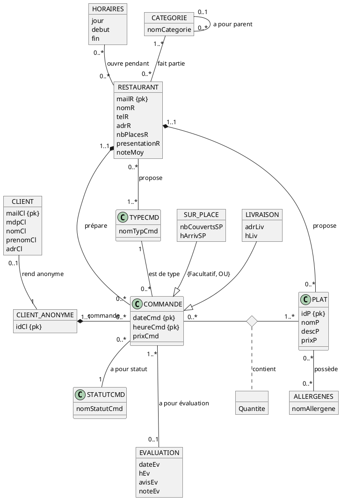

## Schema Entité / Associations

## Contraintes non listées : 

Pour chaque restaurant, la somme des NbCouvertsSp liés ne doit pas dépasser nbPlacesR.\
hSp doit être compatible avec les horaires d'ouverture du restaurant.\
Les horaires d'un restaurant ne se superposent pas.\
Si le champ statutCmd d'une commande est à "annulé client" alors il n'est pas possible d'avoir une évaluation associée à la commande.\

## Explications des choix :

L'intégralité des données personnelles des clients sont enrigstrées dans une entité client qui est dissocié de l'entité clientAnonyme qui ne contient qu'un identifiant. Le reste de l'application interagit exclusivement avec l'entité clientAnonyme. Cette séparation devrait permettre d'oublier un client en toute simplicité.

Une commande est associée à au mois un plat, on considère que les commandes sur places ne sont pas simplement des réservation de table.

Un restaurant peut ne pas proposer de plats, il ne sera alors pas possible d'y effectuer des commandes. Cela simplifie la procédure d'enregistrement d'un restaurant.